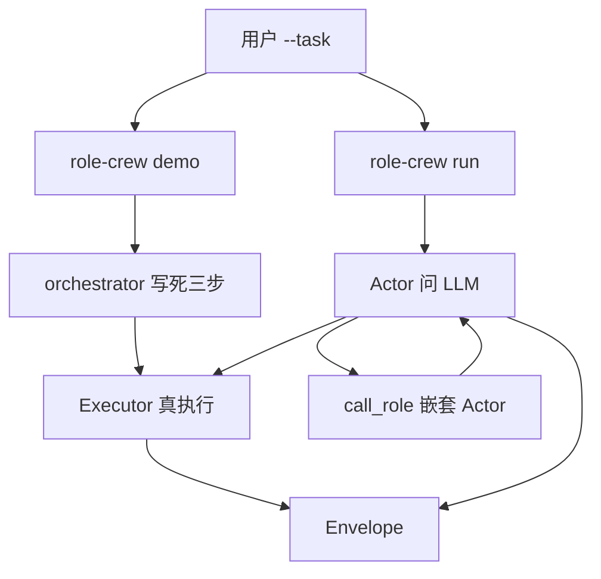

# role-crew

多角色协作：**提问 → 模型选工具 → 本机真执行 → 把回执再问模型 → 用同一份 JSON 信封交接**。  
每个角色必须先做完并验证自己的一小步，才能交给别人。禁止空想「已经搞定了」。

本机不需要 NVIDIA。模型走 HTTP API（当前 `.env` 是阿里云 Token Plan + `glm-5-2`）。

---

## 1. 要解决什么问题

常见写法是：把任务丢给大模型，它用自然语言说「我已经改了文件」。那句话不可信。

本项目反过来：

1. 人给出目标（`--task`）。
2. **dispatcher** 先看有哪些角色、各自能干什么。
3. 需要改文件时 **call_role** 给 **fixer**；fixer 写完必须再读。
4. fixer 再 **call_role** 给 **verifier**；verifier 再读一遍，对了才 `verified`。
5. 每一步的工具 stdout 写进信封的 `evidence`。没有成功证据，代码不允许 `verified`。

模型只负责**选工具、填参数、决定交给谁**。改磁盘、读文件由 Python 执行器做。

---

## 2. 设计原则（对照代码时抓住这几条）

1. **禁止空想**  
   没有工具回执，不得声称完成。实现：`Actor._submit` 发现 `verified` 但 `evidence` 全失败就拒收；`Envelope.require_verified_evidence` 再拦一层。

2. **先做完自己的再往外传**  
   `call_role` 前必须已有本角色成功证据（`Actor._call_role`）。dispatcher 至少先 `list_roles`。

3. **同一套输出（信封）**  
   所有角色结束时都是 `Envelope`，才能互调、才能写进 `traces/`。定义在 `src/role_crew/envelope.py`。

4. **白名单，不拼任意 shell**  
   工具名写在 `configs/tools.yaml`，每个角色能用哪些写在 `roles/*.yaml`。模型不能发明新命令。路径只能落在 `workspace/` 下的 `.txt`。

5. **角色自知**  
   每轮 system prompt 注入：我是谁、我的工具、我能 call 谁、同伴目录（`Actor.system_prompt` + `ROLE_SYSTEM_TEMPLATE`）。

6. **密钥不进仓库**  
   `.env` 已 gitignore。`sk-sp-` 只能打 Token Plan / Coding 入口，不能打普通百炼看图 `dashscope.aliyuncs.com`（`LLMClient.ready_or_raise`）。

---

## 3. 建议读代码的顺序

按这个顺序看，和运行时调用栈一致：

| 顺序 | 文件 | 干什么 |
|---|---|---|
| 1 | `src/role_crew/envelope.py` | 统一信封：`status` / `evidence` / `handoff` |
| 2 | `roles/*.yaml` + `configs/tools.yaml` | 人定义能力；模型不能改这张表 |
| 3 | `src/role_crew/registry.py` | 把 YAML 读成 `RoleCard`，检查 `can_call` 指向存在的角色 |
| 4 | `src/role_crew/executor.py` | 真执行：写/读文件、列角色；沙箱路径 |
| 5 | `src/role_crew/orchestrator.py` | `demo` 硬编码三步；`run_with_llm` 从 dispatcher 起手 |
| 6 | `src/role_crew/actor.py` | 单角色循环：问 LLM → 跑工具 → 再问；嵌套 `call_role` |
| 7 | `src/role_crew/tools_openai.py` | 把白名单翻成 OpenAI function calling；外加 `submit_envelope` |
| 8 | `src/role_crew/llm.py` | HTTP `chat/completions`；429 退避；密钥与入口匹配 |
| 9 | `src/role_crew/main.py` | CLI：`roles` / `tool` / `demo` / `run` |
| 10 | `src/role_crew/trace.py` | 每次运行一份 `traces/*.jsonl` |
| 12 | `src/role_crew/vote.py` | 多次 run 后按信封核投票（忽略 note 原文） |

配置入口：`src/role_crew/config.py`（项目根、`.env`、`MAX_AGENT_STEPS`、`MAX_PEER_DEPTH`）。

---

## 4. 统一信封

所有角色提交的结果都是这个形状（`Envelope`）：

```json
{
  "ok": true,
  "schema_version": "1",
  "role": "fixer",
  "status": "verified",
  "task": "在 workspace 创建 hello.txt，内容为 OK",
  "evidence": [
    {"tool": "write_text", "ok": true, "summary": "已写入 hello.txt"},
    {"tool": "read_file", "ok": true, "summary": "读到 hello.txt（2 字）"}
  ],
  "result": {"path": "hello.txt", "text": "OK"},
  "handoff": null,
  "error": null
}
```

`status` 含义：

| 值 | 含义 | 接下来 |
|---|---|---|
| `verified` | 本角色小目标已用工具验证 | 可结束，或作为 `call_role` 的成功回执 |
| `need_peer` | 自己做不完，要别人 | 必须带 `handoff.to`（且在 `can_call` 里）；编排器会再跑那个角色 |
| `failed` | 失败 | 停或打回 |
| `continue` | 预留，当前循环里主要靠继续调工具 |  |

**硬约束：** `status=verified` 时 `evidence` 里至少一条 `ok: true`。模型填的 evidence 不算，Actor 只采用本轮真正跑过的工具记录。

结束本角色时模型必须调用工具 **`submit_envelope`**（不在 YAML 里，由 `tools_openai.py` 自动塞给每个角色）。代码根据真实 `evidence` 组信封，不信模型口头 JSON。

---

## 5. 角色与工具

### 5.1 角色卡

| 角色 | YAML | 工具 | 可 `call_role` |
|---|---|---|---|
| dispatcher | `roles/dispatcher.yaml` | `list_roles`、`call_role` | fixer、verifier、scout |
| fixer | `roles/fixer.yaml` | `write_text`、`read_file`、`list_workspace`、`call_role` | verifier |
| verifier | `roles/verifier.yaml` | `read_file`、`list_workspace`、`call_role` | fixer |
| scout | `roles/scout.yaml` | `github_search`、`github_readme`、`call_role` | fixer、verifier |

查 GitHub 上的 Skill / Agent 仓库时，dispatcher 应 `call_role scout`，不要让 scout 去写文件（需要落盘再叫 fixer）。

只访问 `https://api.github.com`。匿名有频率限制，可在 `.env` 加 `GITHUB_TOKEN`（GitHub 经典 PAT）。不能打开任意网页、不能搜百度。

以后加角色：新写 `roles/xxx.yaml`，在 `configs/tools.yaml` 登记工具，在 `executor.py` 的 `handlers` 里实现。不要让模型「创建角色并带任意命令」。

### 5.2 工具谁执行

| 工具 | 执行位置 | 说明 |
|---|---|---|
| `list_roles` | `Executor._list_roles` | 返回同伴目录 |
| `list_workspace` | `Executor._list_workspace` | 列出 `workspace/` |
| `write_text` | `Executor._write_text` | 相对路径、仅 `.txt`、禁 `..` |
| `read_file` | `Executor._read_file` | 同上沙箱 |
| `github_search` | `github_tools.github_search` | GitHub 搜仓库，参数 `q` |
| `github_readme` | `github_tools.github_readme` | 读 README，参数 `owner/name` |
| `call_role` | **`Actor._call_role`**，不是 Executor | 嵌套再开一个 Actor；深度 ≤ `MAX_PEER_DEPTH` |
| `submit_envelope` | `Actor._submit` | 提交信封，结束本角色本轮 |

`role-crew tool --name call_role` 会失败：Executor 里标注了只能在 `run` 的 Actor 循环里用。

路径沙箱：`resolve_workspace_path`。绝对路径、盘符、`..`、非 `.txt` 一律拒绝。

---

## 6. 两条运行路径



### 6.1 `demo`：不调模型

`orchestrator.run_demo` 按固定顺序：

1. dispatcher：`list_roles` → 信封 `handoff` 给 fixer  
2. fixer：写 `hello.txt=OK`，再读，一致才 verified  
3. verifier：再读，必须是 `OK`

用来验证信封和执行器，不花 API。对应测试：`tests/test_demo.py`。

### 6.2 `run`：接 API 的真循环

`main.run_cmd` → `Crew`（共享 LLM、执行器、角色表、信封列表）→ `run_with_llm`：

1. 用 **dispatcher** 起一个 `Actor.run(task)`。
2. Actor 循环（最多 `MAX_AGENT_STEPS` 次 LLM 调用）：
   - `llm.chat(messages, tools)`  
   - 若有 `tool_calls`：执行 → `role=tool` 把 JSON 回执追加进 messages → 继续  
   - 若只有说话：提示「请调用工具，完成后 submit_envelope」  
   - `submit_envelope` 成功则本角色返回信封
3. 若 dispatcher 用 `call_role`：深度 +1 再跑子 Actor（防环：`Crew.stack`）。  
   实跑过的顺序一般是 dispatcher → fixer → verifier，再一层层 submit 回来。
4. 若模型走 `need_peer` 而不是 `call_role`：`run_with_llm` 的 while 会按 `handoff` 再起一个 Actor。

GLM 可能在同一轮既给 `content` 又给 `tool_calls`。有 tool_calls 时只执行工具，不把那段话当成最终信封（`Actor._run_loop`）。

限流：HTTP 429 时 `LLMClient.chat` 指数退避重试；成功后额外 `sleep(1.2)`，减轻 Token Plan 突发限流。

---

## 7. 操作（本机）

环境只要建一次：

```powershell
cd C:\Users\wenjin\Desktop\wwjfiles\role-crew
python -m venv .venv
.\.venv\Scripts\python.exe -m pip install -e ".[dev]"
```

PowerShell 若拦 `Activate.ps1`，不必 activate，直接用上面的 `.\.venv\Scripts\python.exe`。

### 7.1 不调模型

```powershell
.\.venv\Scripts\role-crew.exe demo
.\.venv\Scripts\role-crew.exe roles
.\.venv\Scripts\role-crew.exe tool --role fixer --name write_text --arg path=hello.txt --arg text=OK
.\.venv\Scripts\role-crew.exe tool --role scout --name github_search --arg q="cursor skill OR claude skill"
.\.venv\Scripts\python.exe -m pytest
```

成功时 `workspace/hello.txt` 内容为 `OK`。

### 7.2 接 API

`.env`（不要提交 git）：

```
LLM_API_KEY=你的密钥
LLM_BASE_URL=https://token-plan.cn-beijing.maas.aliyuncs.com/compatible-mode/v1
LLM_MODEL=glm-5-2
MAX_AGENT_STEPS=16
MAX_PEER_DEPTH=2
```

- Token Plan：**`sk-sp-` + 上面这个 token-plan 入口**（当前本机就是这样配的）。  
- 百炼按量通用 Key：`sk-`（没有 `-sp-`）+ `https://dashscope.aliyuncs.com/compatible-mode/v1` + 如 `qwen-plus`。  
- 不要把 `sk-sp-` 拿去打普通 dashscope 看图接口，会 401。

```powershell
.\.venv\Scripts\role-crew.exe run --task "在 workspace 创建 hello.txt，内容为 OK，确认后再结束。"
```

stdout 是各角色信封列表；`traces/<时间>-<id>.jsonl` 可回放每一步 LLM / 工具。若刚跑过立刻再跑，可能 429，等几秒或看重试是否成功。

### 7.3 多次询问取多数（vote）

同一 `--task` 跑 n 次（默认 10），对信封的**结构化核**计票，不按 `note` 逐字比较。核包括：`status`、搜到的仓库名、写入的 `path`/`text`、是否有 error。

```powershell
.\.venv\Scripts\role-crew.exe vote --n 10 --temperature 0.7 --task "帮我查询 github 上有哪些 agent skill"
```

输出里的 `probability` 是 `k/n`（该类出现频率），**不是**标准答案的真实概率。`< 0.5` 时 `unstable=true`，进程退出码 3。温度要用大于 0，否则 10 次几乎相同。费用大约是 `run` 的 n 倍，也更容易 429。

---

## 8. 目录

```
role-crew/
  roles/                 角色卡（人写，不是模型写）
  configs/tools.yaml     工具名、参数、描述
  workspace/             唯一允许改的目录（演示写 hello.txt）
  traces/                运行审计，gitignore
  .env                   密钥，gitignore
  .env.example           无密钥的模板
  src/role_crew/         源码，见第 3 节
  tests/                 pytest
```

CLI 入口：`pyproject.toml` 里 `role-crew = role_crew.main:app`。

---

## 9. 以后可以加、现在故意不做

- 不让模型现场创建角色并附带任意命令。  
- 不默认 SSH、不默认改麒麟 / 拓扑视图（以后可做成新的 `roles/*.yaml` + executor handler）。  
- `call_role` 深度默认 2，避免 A 调 B 调 A 无限套。
